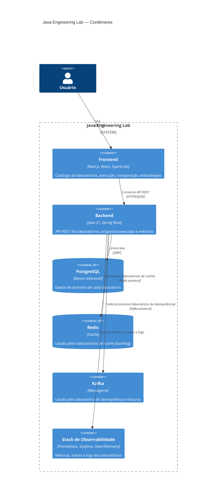

# Diagrama C4 — Nível 2 (Contêiner)

> Status: proposta inicial, sujeita a revisão junto com
> `specs/architecture/SPEC-JEL-002-arquitetura.md`. Reflete o alvo do MVP
> (Fase 2/3) — Kafka e Redis aparecem porque fazem parte da stack
> obrigatória, mas só entram em uso efetivo a partir dos laboratórios que
> os exigem (Fases 4/5).

