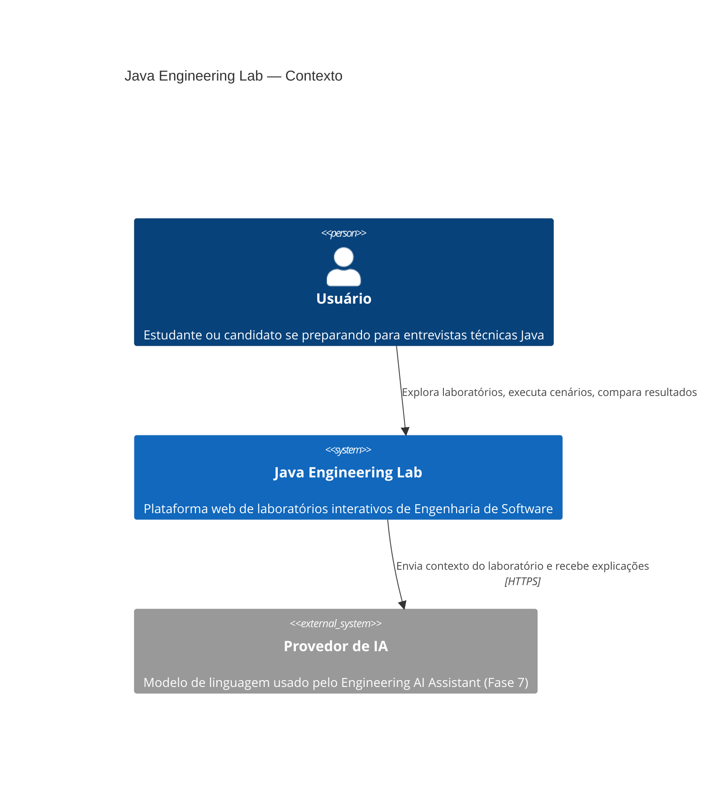

# Diagrama C4 — Nível 1 (Contexto)

> Status: proposta inicial, sujeita a revisão junto com
> `specs/architecture/SPEC-JEL-002-arquitetura.md`.

```mermaid
C4Context
    title Java Engineering Lab — Contexto

    Person(usuario, "Usuário", "Estudante ou candidato se preparando para entrevistas técnicas Java")

    System(jel, "Java Engineering Lab", "Plataforma web de laboratórios interativos de Engenharia de Software")

    System_Ext(ia, "Provedor de IA", "Modelo de linguagem usado pelo Engineering AI Assistant (Fase 7)")

    Rel(usuario, jel, "Explora laboratórios, executa cenários, compara resultados")
    Rel(jel, ia, "Envia contexto do laboratório e recebe explicações", "HTTPS")
```
