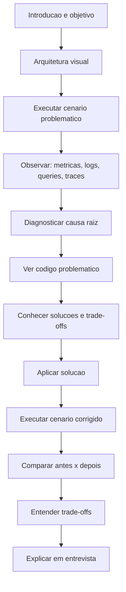
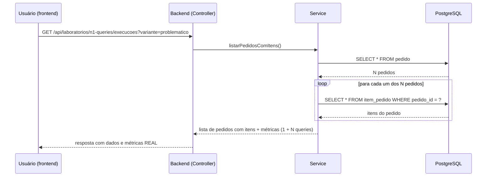

# Fluxo padrão de um laboratório

> Status: proposta inicial. Referência: seção 17 do prompt mestre do
> projeto, registrado em `docs/conversation-history.md`.

## Diagrama de sequência — laboratório de N+1 (variante problemática)

Referência de implementação: `specs/labs/SPEC-LAB-N1-001-n-mais-um-queries.md`.

